# 一、下载安装破解

下载地址：https://www.jetbrains.com/zh-cn/idea/

# 二、配置参数

### 项目默认存储位置

File——>Settings——>Appearance & Behavior——>System Settings——>project opening——>default directory设置默认路径

### 关闭自动更新

File——>Settings——>Appearance & Behavior——>System Settings——>Updates下取消Automatically check updates for勾选

### 隐藏.idea文件夹和.iml文件

IntelliJ IDEA项⽬目会⾃自动⽣生成⼀一个.idea⽂文件夹和.iml⽂文讲，看着实在是碍眼，所以对以上⽂文件进⾏行行隐藏处理理 在File——>Settings——>Editor——>File Types下的”Ignore files and folders”⼀一栏添加 *.idea;*.iml;

### 文件编码设置UTF-8

File——>Settings——>Editor——>File Encodings

Global Encoding:UTF-8

Project Encoding:UTF-8

Default encoding for properties files:UTF-8 勾选上Transparent native-to-ascii conversion

### 自动导包

File——>Settings——>Editor- >General——>Auto Import下进⾏配置，Insert imports on paste 选择All，其余四个选项全部勾选

### 自动编译

File——>Settings——>Build，Execution，Development—>complier—>build project automatically打勾

### 设置主题

File——>Settings——>Appearance&Behavior——>appearance——>theme——>选择主题

### 代码提示忽略大小写

editor——>general——>code completion——>取消match case

### 换行符使用 Unix 格式

editor——>code style——>General——>Line separator——>Unix and macOS(\n)

### 自动换行

File——>Settings——>Editor–>General–>Soft wraps—>soft wraps files后面输入框内添加;*.java

把文件类型清空，然后输入*.*就能匹配全部文件格式自动换行

### 软换行

左侧代码行号，鼠标右键—>Soft wrap

### maven设置

File——>Settings——>Build,Execution,Deployment——>Build Tools——>Maven下对Maven进⾏配置，

1. user settings file:指定Maven的settings.xml位置
2. local repository: 指定Maven的本地仓库位置，是读取settings.xml⾃动配置的
3. maven home directory:指定本地Maven的安装⽬录所在，这⾥可以选择你的Maven安装⽬录

### 设置鼠标悬浮提示

File–>settings–>Editor–>General–>勾选Show quick documentation...

### 快捷键代码提示

keymap——>Main menu——>code——>completion——>Basic——>先Remove再Add，alt+/

### 快捷键关闭单个Tab

keymap——>Main menu——>Window——>Editor tabs——>close——>先Remove再Add，control+w

### 注释斜体改为正体

File–>settings–>Editor–>color scheme——>Language defaults——>comments——>Doc comment——>text以及line comment取消勾选italic

### 单行显示多个Tabs

File–>settings–>Editor–>General -——>Editor Tabs–>去掉show tabs in single row的√

### 改变Tabs位置到左侧

点击任意一个Tab，右键configuration editor tabs——>tab placement属性由Top改为Left

File–>settings–>Editor–>General -——>Editor Tabs——>tab placement属性由Top改为Left

### Tabs排序

点击任意一个Tab，右键configuration editor tabs——>Tab order——>sort tabs alphabetically

File–>settings–>Editor–>General -——>Editor Tabs——>Tab order——>sort tabs alphabetically

### terminal

File–>settings–>terminal——>将cmd.exe换为git/bin/bash.exe

### 将git的push命令显示在工具栏

File–>settings–>Appearance&Behavior——>Manu and Toolbars——>navigation Bar Toolbar——>NavBarVCS group——>VCSNavToolbarActions——>add action ——> version control systems ——>Git——>Repository——>找到push

### 生成序列化ID

File ——> Settings ——> Editor ——> Inspections ——> 搜索 Serialization issues ，找到 Serializable class without 'serialVersionUID' ——>打上勾，Apply——>OK，把鼠标放在在类名前会自动提示添加序列化id

### 显示内存使用情况

File-——>settings-——>apperance-——>window options-——>show memory indicator

### springboot项目显示run dashboard

找到.idea下面的workspace.xml文件  2.在下面的代码中加入一段配置代码  源代码位置

```
<component name="RunDashboard">
 <option name="ruleStates">
     <list>
       <RuleState>
           <option name="name" value="ConfigurationTypeDashboardGroupingRule" />
       </RuleState>
       <RuleState>
          <option name="name" value="StatusDashboardGroupingRule" />
       </RuleState>
     </list>
  </option>
  <option name="contentProportion" value="0.22874807" />
  <option name="configurationTypes">
     <set>
          <option value="SpringBootApplicationConfigurationType" />
     </set>
  </option>
 </component>
```

### 代码搜索设置

```
全局搜索control+shift+F之后在Match case  Words 之后的箭头勾选隐藏的Regex进行正则表达式搜索
```

### 前进后退添加到工具栏

File——>Appearance & Behavior——>Menu and Toolbars——>Navigation Bar Toolbar——>Toolbar Run Actions——>Add Action——>Main menu——>Navigate——>ctrl选中Back和Forward——>点击ok


# 三、快捷键对比

不特殊说明Mac版，一般可用command替代Ctrl，option代替Alt

| 描述                                                         | Windows                 | Mac Os        |
| ------------------------------------------------------------ | ----------------------- | ------------- |
| 进入光标所在的方法/变量的接口/定义处 Ctrl + 鼠标左击         | Ctrl + B                |               |
| 跳转到类型声明处                                             | Ctrl + Shift + B        |               |
| 在某个调用的方法名上使用会跳转到具体的实现处，可以跳过接口   | Ctrl + Alt + B          |               |
| 快速查看光标所在的方法/类的定义                              | Ctrl + Shift + I        |               |
| 查找光标所在的方法 / 变量 / 类被调用的地方                   | Alt + F7                |               |
| 显示使用的地方。寻找被该类或是变量被调用的地方，用弹出框的方式找出来 | Ctrl + Alt + F7         |               |
| 弹出框查询所有使用的地方                                     | Ctrl + Shift + Alt + F7 |               |
| 跳转到下一个 高亮错误 / 警告位置                             | F2                      |               |
| 跳转到上一个高亮错误 / 警告位置                              | Shift + F2              |               |
| 方法参数提示显示                                             | Ctrl + P                | Command   + P |
| 光标所在的变量/类名/方法名等上面（也可以在提示补充的时候按），显示文档内容 | Ctrl + Q                |               |
| 前往当前光标所在的方法的父类的方法/接口定义                  | Ctrl + U                |               |
| 显示当前类的层次结构                                         | Ctrl + H                |               |
| 调用层次                                                     | Ctrl + Alt + H          |               |
| 弹出当前文件结构层，可以在弹出的层上直接输入，进行筛选       | Ctrl + F12              | Command + F12 |
| 显示当前文件结构                                             | Alt + 7                 |               |
| 定位/显示到当前文件的 Navigation Bar                         | Alt + Home              |               |
| 高亮显示所有该选中文本，按 Esc 高亮消失                      | Ctrl + Shift + F7       |               |

## 代码运行

| 描述                                                         | Windows            | Mac Os                |
| ------------------------------------------------------------ | ------------------ | --------------------- |
| 工具栏的 Run 按钮 ​                                           | Shift + F10        |                       |
| 等效于点击工具栏的 Debug 按钮                                | Shift + F9         | Command + D           |
| Run 当前代码                                                 | Ctrl + Shift + F10 | Control + Shift + R/D |
| 弹出 Run 的可选择菜单                                        | Alt+ Shift + F10   | Control + Shift + R   |
| 编译选中的文件/包/Module                                     | Ctrl + Shift + F9  | Command + Shift + F9  |
| Debug 模式下,如当前行断点是一个方法,则进入当前方法,如果该方法体还有方法,则不会进入该内嵌方法 | F7                 | F7                    |
| Debug 模式下,如当前行断点是一个方法,则不进入当前方法         | F8                 | F8                    |
| Debug 模式下,恢复程序运行,但是如果该断点下面代码还有断点则停在下一个断点上 | F9                 | F9                    |
| 在 Debug 模式下，设置光标当前行为断点，如果当前已经是断点则去掉断点 | Ctrl + F8          | Option + F8           |
| 在 Debug 模式下，跳出，表现出来的效果跟 F9 一样              | Shift + F8         | Shift + F8            |
| 弹出所有的 Debug 列表                                        | Ctrl + Shift + F8  | Command + Shift + F8  |
| 在 Debug 模式下，智能步入。断点所在行上有多个方法调用，会弹出进入哪个方法 | Shift + F7         | Shift + F7            |
| 弹出 Debug 的可选择菜单                                      | Alt+ Shift + F9    |                       |
| Debug 模式下,进入当前方法体内                                | Alt+ Shift + F7    |                       |

## 文本编辑

| 描述                                                        | Windows                         | Mac Os              |
| ----------------------------------------------------------- | ------------------------------- | ------------------- |
| 在当前文件进行文本替换                                      | Ctrl + R                        | Command + R         |
| 根据输入内容替换对应内容，范围为整个项目或 指定目录内文件   | Ctrl + Shift + R                | Command + Shift + R |
| 撤销                                                        | Ctrl + Z                        | Command + Z         |
| 删除光标所在行或 删除选中的行                               | Ctrl + Y                        |                     |
| 复制光标所在行 / 复制选择内容                               | Ctrl + C                        |                     |
| 剪切光标所在行 / 剪切选择内容                               | Ctrl + X                        | Command + X         |
| 复制光标所在行 / 复制选择内容，并把复制内容插入光标位置下面 | Ctrl + D                        | Command + D         |
| 取消撤销                                                    | Ctrl + Shift + Z                | Command + Shift + Z |
| 删除光标后面的单词或是中文句                                | Ctrl + Delete                   |                     |
| 删除光标前面的单词或是中文句                                | Ctrl + BackSpace                | Option + BackSpace  |
| 光标所在行上空出一行，光标定位到新行                        | Ctrl + Alt + Enter              |                     |
| 复制当前文件磁盘路径到剪贴板                                | Ctrl + Shift + C                |                     |
| 删除变量、方法、类、文件等                                  | Alt + Delete                    |                     |
| 批量修改名称                                                | Shift + F6                      |                     |
| 同时编辑多个内容                                            | Ctrl + Alt + Shift              |                     |
| 纵向选择多行代码                                            | Alt + 鼠标左键并拖动            |                     |
| 查看复制历史                                                | Ctrl+shift+V  Ctrl+Shift+Insert |                     |

## 代码选择

| 描述                                                         | Windows            | Mac Os               |
| ------------------------------------------------------------ | ------------------ | -------------------- |
| 行首行尾                                                     | Home / End         |                      |
| 在当前文件跳转到指定行处                                     | Ctrl + G           |                      |
| 光标跳转到当前单词 / 中文句的左侧开头位置                    | Ctrl + ←           | Option + ←           |
| 光标跳转到当前单词 / 中文句的右侧开头位置                    | Ctrl + →           | Option + →           |
| 展开/折叠代码                                                | Ctrl + +/-         | Option + +/-         |
| 展开/折叠所有代码                                            | Ctrl + Shift + +/- | Option + Shift + +/- |
| 跳到文件头                                                   | Ctrl + Home        | Command + ↑          |
| 跳到文件尾                                                   | Ctrl + c           | Command + ↓          |
| 选中光标到当前行头位置                                       | Shift + Home       | Command + ←          |
| 选中光标到当前行尾位置                                       | Shift + End        | Command + →          |
| 开始新一行。光标所在行下空出一行，光标定位到新行位置         | Shift + Enter      | Shift + Enter        |
| 退回到上一个操作的地方                                       | Ctrl + Alt + ←     | Option + Command + ← |
| 前往到下一个操作的地方                                       | Ctrl + Alt + →     | Option + Command + → |
| 移动光标到当前所在代码的花括号开始位置                       | Ctrl + [           |                      |
| 移动光标到当前所在代码的花括号结束位置                       | Ctrl + ]           |                      |
| 选中从光标所在位置到它的顶部中括号位置                       | Ctrl + Shift + [   |                      |
| 选中从光标所在位置到它的底部中括号位置                       | Ctrl + Shift + ]   |                      |
| 移动光标到当前所在代码的开始或结束位置                       | Ctrl + Shift + M   |                      |
| 切换当前已打开的窗口中的子视图                               | Alt+ ←             |                      |
| 按切换当前已打开的窗口中的子视图                             | Alt+ →             |                      |
| 当前光标跳转到当前文件的前一个方法名位置                     | Alt + ↑            |                      |
| 当前光标跳转到当前文件的后一个方法名位置                     | Alt + ↓            |                      |
| 选中跨屏幕代码，左键点击开始位置，找到结尾位置shift+左键点击结尾位置即可 | shift+鼠标左键     |                      |

## 内容查找

| 描述                                                         | Windows                | Mac Os               |
| ------------------------------------------------------------ | ---------------------- | -------------------- |
| 弹出 SearchEverywhere 弹出层                                 | double Shift           | Double Shift         |
| 在当前文件进行文本查找                                       | Ctrl + F               | Command + F          |
| 根据输入的 类名 查找类文件                                   | Ctrl + N               | Command + O          |
| 根据输入内容查找整个项目或 指定目录内文件                    | Ctrl + Shift + F       | Command + Option + F |
| 通过文件名定位/打开文件/目录,打开目录需要在输入的内容后面多加一个/ | Ctrl + Shift + N       | Command + Shift + O  |
| 查找动作/设置                                                | Ctrl + Shift + A       | Command + Shift + A  |
| 前往指定的变量/方法                                          | Ctrl + Shift + Alt + N | Command + Option + O |
| 在查找模式下，定位到下一个匹配处                             | F3                     | Command + G          |
| 在查找模式下，查找匹配上一个                                 | Shift + F3             | Command + Shift + G  |
| 调转到所选中的词的下一个引用位置                             | Ctrl + F3              |                      |

## 代码辅助

| 描述                                                         | Windows                | Mac Os                                     |
| ------------------------------------------------------------ | ---------------------- | ------------------------------------------ |
| 插入自定义动态代码模板                                       | Ctrl + J               | Command + J                                |
| 基础代码补全                                                 | Ctrl + Space (Alt + /) | Control + Space                            |
| 智能代码提示                                                 | Ctrl + Shift + Space   | Control + Command + Space                  |
| 自动结束代码，行末自动添加分号                               | Ctrl + Shift + Enter   | Command + Shift + Enter                    |
| 代码自动生成，如生成对象的 set / get 方法，构造函数，toString() 等 | Alt + Insert           | Command  + N, Control + Enter, Control + N |
| 根据光标所在问题，提供快速修复选择，光标放在的位置不同提示的结果也不同 | Alt + Enter            | Option + Enter                             |
| 弹出模板选择窗口，将选定的代码加入动态模板中                 | Ctrl + Alt + J         | Command + Option + J                       |
| 选择可重写的方法                                             | Ctrl + O               | Command + O                                |
| 选择可继承的方法                                             | Ctrl + I               | Command + I                                |
| 对当前类生成单元测试类，如果已经存在的单元测试类则可以进行选择 | Ctrl + Shift + T       | Command + Shift + T                        |

## 代码优化

| 描述                                                         | Windows               | Mac Os               |
| ------------------------------------------------------------ | --------------------- | -------------------- |
| 注释光标所在行代码，会根据当前不同文件类型使用不同的注释符号 | Ctrl + /              | Command + /          |
| 代码块注释                                                   | Ctrl + Shift + /      | Command + Shift + /  |
| 缩进                                                         | Tab                   | Tab                  |
| 取消缩进                                                     | Shift + Tab           | Shift + Tab          |
| 格式化代码，可以对当前文件和整个包目录使用                   | Ctrl + Alt + L        | Control + Option + L |
| 优化导入的类，可以对当前文件和整个包目录使用                 | Ctrl + Alt + O        | Control + Option + O |
| 光标所在行或 选中部分进行自动代码缩进，有点类似格式化        | Ctrl + Alt + I        | Control + Option + I |
| 对选中的代码弹出环绕选项弹出层                               | Ctrl + Alt + T        | Command + Option + T |
| 对选中的代码进行大/小写轮流转换                              | Ctrl + Shift + U      | Command + Option + U |
| 自动将下一行合并到当前行末尾                                 | Ctrl + Shift + J      | Control + Shift + J  |
| 快速移除环绕代码                                             | Ctrl + Shift + Delete |                      |
| 重构-快速提取参数到方法                                      | Ctrl + Alt + P        | Command + Shift + P  |
| 重构-快速提取常量                                            | Ctrl + Alt + C        | Command + Shift + C  |
| 重构-快速提取成员变量                                        | Ctrl + Alt + F        | Command + Shift + F  |
| 重构-快速提取变量                                            | Ctrl + Alt + V        | Command + Shift + V  |
| 重构-快速提取方法                                            | Ctrl + Alt + M        | Command + Shift + M  |
| 对文件 / 文件夹 重命名                                       | Shift + F6            | Shift + F6           |
| 移动光标所在行向上移动                                       | Alt + Shift + ↑       |                      |
| 移动光标所在行向下移动                                       | Alt + Shift + ↓       |                      |
| 光标放在方法名上，将方法移动到上一个方法前面，调整方法排序   | Ctrl + Shift + ↑      |                      |
| 光标放在方法名上，将方法移动到下一个方法前面，调整方法排序   | Ctrl + Shift + ↓      |                      |

## 版本控制

| 描述                           | Windows         | Mac Os             |
| ------------------------------ | --------------- | ------------------ |
| 显示版本控制常用操作菜单弹出层 | Alt + ~         | Command + V        |
| 版本控制提交项目 git commit    | Ctrl + K        | Command + K        |
| 版本控制更新项目 git pull      | Ctrl + T        | Command + T        |
| 版本控制显示最近修改项目       | Alt + Shift + C | Option + Shift + C |

## IDE 相对路径

| 描述                                                         | Windows                | Mac Os                |
| ------------------------------------------------------------ | ---------------------- | --------------------- |
| 弹出该文件路径                                               | Ctrl + Alt + F12       |                       |
| 在打开的文件标题上，弹出该文件路径                           | Ctrl + 鼠标左击        |                       |
| 显示当前文件选择目标弹出层，弹出层中有很多目标可以进行选择   | Alt + F1               |                       |
| 打开 IntelliJ IDEA 系统设置                                  | Ctrl + Alt + S         | Command + ,           |
| 打开当前项目设置                                             | Ctrl + Shift + Alt + S | Command + ;           |
| 编辑器最大化                                                 | Ctrl + Shift + F12     | Command + Shift + F12 |
| 隐藏当前或 最后一个激活的工具窗口                            | Shift + Esc            | Shift + Esc           |
| 从工具窗口进入代码文件窗口                                   | Esc                    | Esc                   |
| 编辑窗口切换，如果在切换的过程又加按上 delete，则是关闭对应选中的窗口 | Ctrl + Tab             | Control + Tab         |
| 显示最近打开的文件记录列表                                   | Ctrl + E               |                       |
| 显示修改历史                                                 | Ctrl + Shift + E       |                       |


# 四、插件

Lombok，Key promoterX，Json Parser，Free Mybatis plugin，Translation，CodeGlance

# 五、启动项目

## 启动方式

1_右键run启动

2_菜单栏启动

3_Run窗口运行 

## 启动参数

菜单栏——>edit configuration 

用法一：启动参数-D可以覆盖application.properties的配置，例：-Dserver.port.8081

用法二：配合maven，用于多环境切换 ，例：-Dprofile=test/dev

# 六、调试项目

## 原生Debug实现热部署

项目以debug模式启动，然后修改代码，点击导航栏Build——>Build Project

## 基本断点调试

蓝色背景 的行就是当前程序停顿的行

step over（F8），执行到当前方法的下一行，步过

step into（F7），进入当前行调用的方法体，步过

step out（shift+F8），执行完当前的方法，步过

force step into（alt+shift+F7），可以进入第三方jar包或者jdk自带方法内部

Alt+Shift+F8，强制步过

Alt+F9，运行至光标处
Ctrl+Alt+F9，强制运行至光标处

鼠标悬停在变量上，变量下方灰色阴影点击展开即可查看变量属性

debug窗口step out右边drop frame可以回溯到上个方法内


## 断点管理

断点右键可以设置其属性 ，去掉enabled，保留断点位置又可以跳过断点

view breakpoints 可以管理所有断点及其属性

mute breakpoints取消所有断点

### 条件断点（问号）

循环条件断点：当循环到第几次的时候停止，在相应断点属性condition内填写Java代码条件i == 2，这样断点右下角有个问号，表明是条件断点

期望条件断点：当某个属性值等于期望值时停止

### 异常断点（闪电）

在view breakpoints界面，点+号新增Java Exception Breakpoints，写一个异常。闪电标识

### 添加变量监控

debugger界面，variables添加眼镜按钮，输入Java代码变量


# 七、代码模板

## 修改方法注释模版

File——>Settings——>Editor——>Live Templates下添加⾃定义Template Group，并在⾃定义Template Group下添加⾃定义Template

第一个

```java
**
 * @description :
$params$
 * @return : $return$
 * @author : $user$
 * @date : $date$ $time$
 */
 
 Params形参自动获取

groovyScript("def result=''; def params=\"${_1}\".replaceAll('[\\\\[|\\\\]|\\\\s]', '').split(',').toList(); for(i = 0; i < params.size(); i++) {result+=' * @param ： ' + params[i]  + ((i < params.size() - 1) ? '\\n' : '')}; return result", methodParameters())

return	methodReturnType()

author	user()

date	date()

time	time()
```

第二个

```java
**
 * @description: 
 *
 * $VAR1$ $params$
 * @return $returns$
 * @author $user$
 * @date $date$ $time$
 */
 
 VAR1		groovyScript("   def result='';    def params=\"${_1}\".replaceAll('[\\\\[|\\\\]|\\\\s]', '').split(',').toList();     for(i = 0; i < params.size(); i++) {         if(i!=0)result+= ' * ';         result+='@param ' + params[i] + ((i < (params.size() - 1)) ? '\\n' + '\\t' : '');     };     return result", methodParameters())
 
 params
 returns	methodReturnType()
 user		user()
 date		date()
 time		time()
```

## postfix

先打变量或者表达式，再打.快捷键，例：user.null、i==1.if、user.sout、list.size().fori

# 八、Git

## 创建版本库

初始化一个Git的版本库操作顺序：导航栏VCS——>Import into Version Control——>Create Git Repository，会弹出一个浏览文件的对

话框，如下如所示，选择需要的目录即可。但是在实际开发中几乎不需要这样的操作。

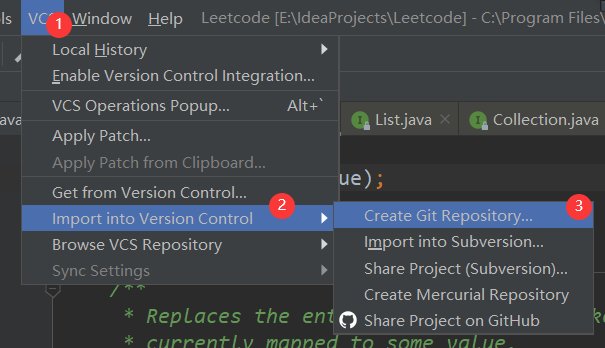

## 远程仓库

操作远程仓库前需要准备好下面三个要素

```
1. 安装Git并配置；
2. 申请一个GitHub账号，Gitee和GitLab都是一个道理；
3. 在IntelliJ IDEA上登录GitHub
```

### 添加远程仓库

#### 方法一：

```
第一步：创建好你的项目后，操作顺序：导航栏VCS—>Import into Version Control—>Share Project on GitHub，如下图点击。
```

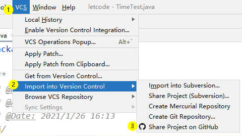

```
第二步：填写弹出分享项目到GitHub的窗口。
```

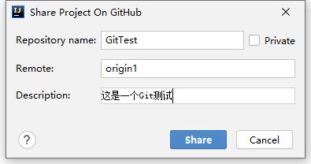

Repository name就是仓库名。Remote就是远程仓库名。origin这是Git默认的叫法，也可以改成别的，但是origin这个名字一看就知道是

远程库。Description就是项目描述。private是设置是否私有，私有库别人看不见。

```
第三步：单机Share，会自动进行一个add+commit的操作。就是将创建的代码添加到自动创建的本地仓库。
```


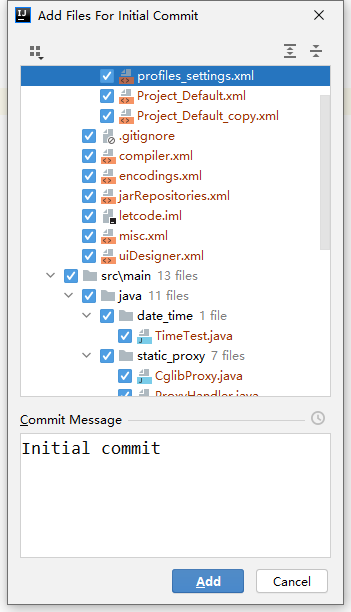

这个对话框的意思就是以后会自动add所有新添加的文件到暂存区。打上不再提醒的对勾，点击Add就大功告成了。

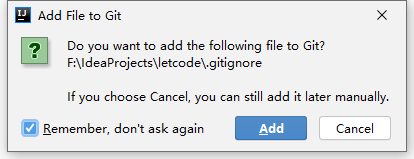

创建完成之后，来到GitHub主页，就可以找到自己的库了。

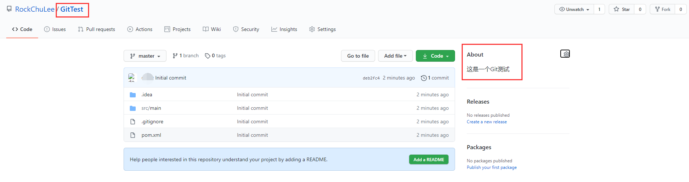

这样做的好处就是——你可以在本地进行适当的开发，例如环境的配置和项目的初始化，之后再上传Git。而不是连接一个空的远程库，

在搭建一个SpringBoot环境。

但是同样有弊端，快捷方式只能分享到GitHub，其他的远程仓库暂不支持，像有的公司在自己的Git库上面开发，自然使用不了。

#### 方法二：

第一步：复制远程仓库URL

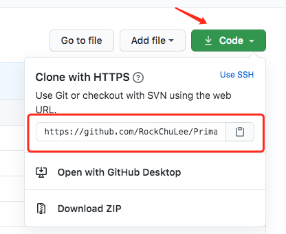

第二步：切换git远程提交位置，VCS—>Git—>Remotes

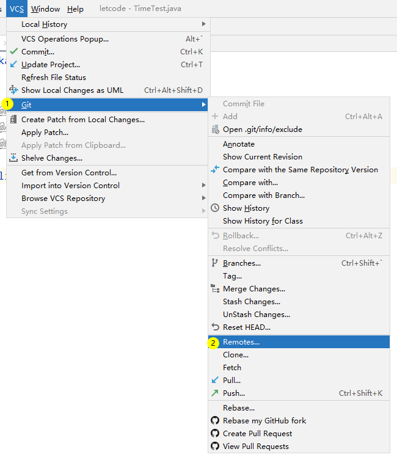

第三步：然后修改远程仓库URL

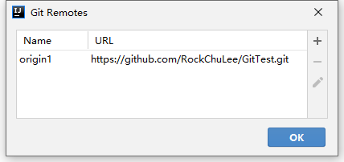

### 克隆（clone）项目

第一步：
先找到需要克隆的项目的链接，如图所示


第二步：导入
File -> new -> Project from Version Control或者Get from Version Control

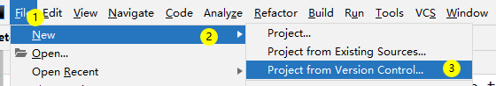

版本控制选择git，URL框输入git联接，编辑本地的存储位置，单击clone即可。

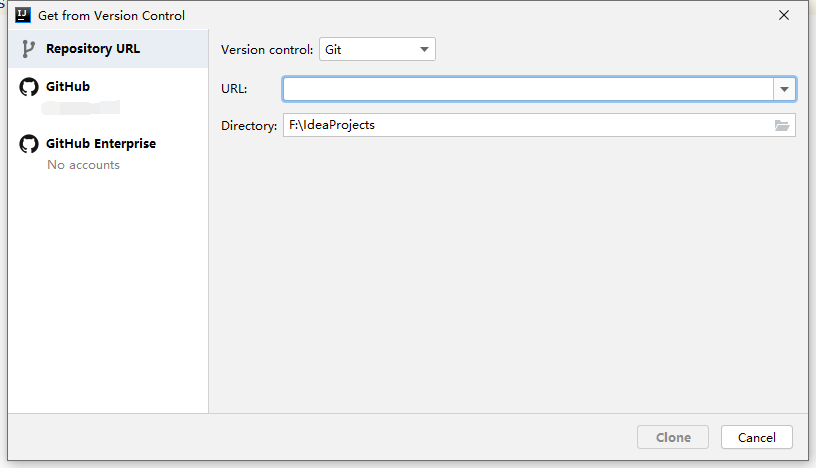

#### ssh和https区别

```
Git支持多种协议，默认的git://使用ssh，但也可以使用https等其他协议。
使用https除了速度慢以外，还有个最大的麻烦是每次推送都必须输入口令，但是在某些只开放http端口的公司内部就无法使用ssh协议而只能用https。
```

### 删除远程仓库

删除远程仓库的操作必须在GitHub上面进行，方法如下：

打开项目->Setting->Options->(拉到最下面找到)Delete this repository，弹出以下界面，重新输入一下项目名。

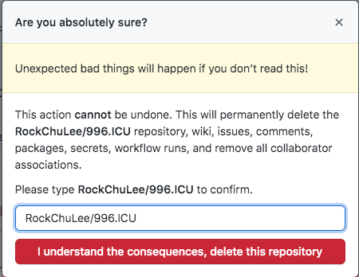

还需要输入GitHub密码，就可以删除了。如果是想让本地和远程库失去连接，在remote界面，点这个小减号就行。

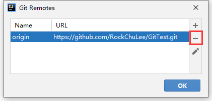

## 文件状态更改

### add+commit

将一个文件创建并存放到Git的本地仓库的动作叫做提交（commit）。其分为三步，第一步自然是创建文件，第二步是将文件添加

（add）到暂存区，然后再commit到本地仓库。

第一步：创建文件，自动add

首先我们新建一个文件readme.txt，由于之前的设置，idea会自动add所有的新建文件，所以在使用idea的过程中我们完全不需要add。

已经add的文件在IntelliJ IDEA中显示绿色，未add的显示红色。

如果需要手动add，在指定文件上右键Git—>+add即可，如下图操作所示。

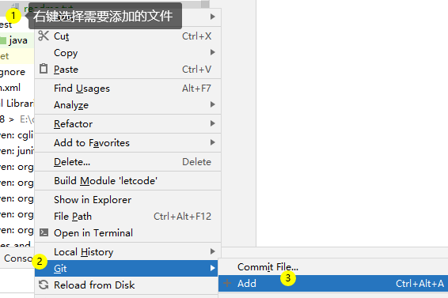

第二步：commit

快捷键Ctrl+K，或者点击编辑器右上角的绿色小对勾（也可能在左上角）。


弹出的对话框就是使用`git status`指令查看是否有内容被修改的可视化界面，如下（vcs.xml是idea的初始化文件，请无视）

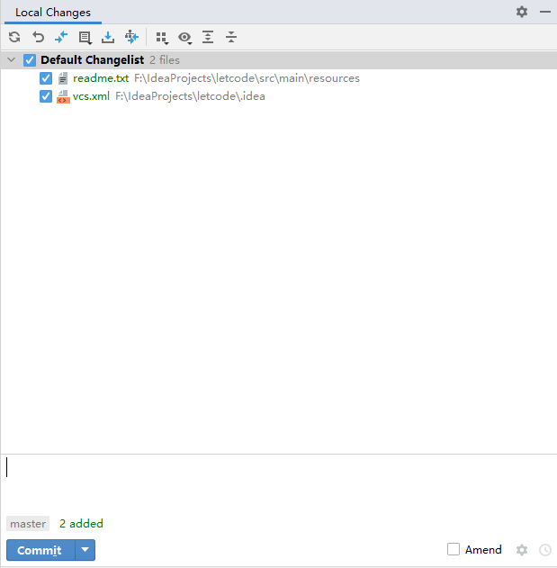

双击你想看的文件，就可以知道有哪些修改了。这和`git diff`是一样的

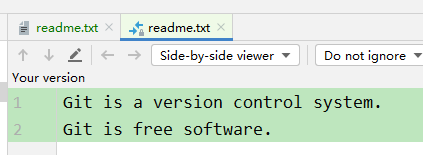

无论是文件还是代码，红色代表没有进行add，绿色代表and但未commit，蓝色代表已经commit且有改动，灰色代表已经删除的但未

commit。

在红框中填写提交的信息wrote a readme file，然后我们点击图片上的Commit按钮，即可完成提交。这完全可以理解为Git指令`git `

`commit -m "wrote a readme file"`

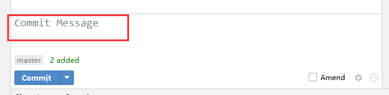

交完成后可以在项目名右键—>Git—>Show History查看日志。相当于`git log`

### 快速查看提交记录

方法一：代码行数右键，点击Annotate，，可以看到提交时间以及提交人，直接双击可以看到当时提交的所有记录

方法二：项目名右键—>Git—>Show History

方法三：左下角Git—>log

### 版本回退

#### Reset

项目名右键—>Git—>Show History—>选中某次提交记录—>Reset Current Branch to here，如下图所示。

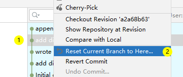

会弹出下面的提示框。

git_reset_2.png

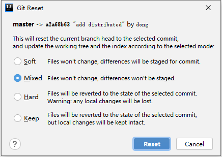

简单翻译一下：

这会重设当前分支的head到选择的commit，并且更新工作树和暂存空间依照选择的模式

软：文件不会更改，不同会被储存

混合：文件不会更改，不同不会被储存

硬：文件会被转换到被选择的提交的状态，提示：任何修改都会丢失

保持：文件会被转换到被选择的提交的状态，但是本地的修改会被完整保存

像上图提示一样，这种方法容易造成数据丢失，可以通过`git reflog`查看提交的id，再`reset`回去。

在多人共同编码的时候，这样的回退不仅容易删除别人的代码，而非常容易操作混乱，造成了很多不必要的麻烦。所以在实际开发中，如

果我们需要回退某个提交，我们会使用到`revert`。

#### Revert

项目名右键—>Git—>Show History—>选中某次提交记录—>Revert Commit，如下图所示

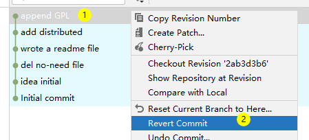

点击之后，会发现文件退回的同时，弹出一个commit的对话框，如下：

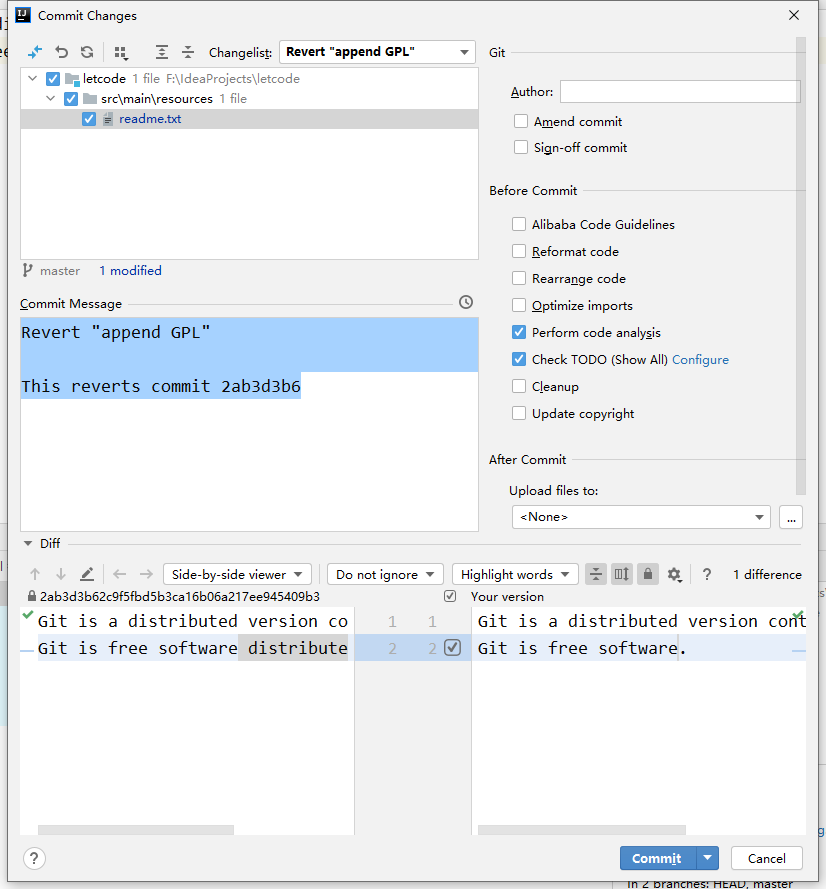

这就是 reset 和 revert 的区别。reset只不过是向后移动了Head指针，如下图：

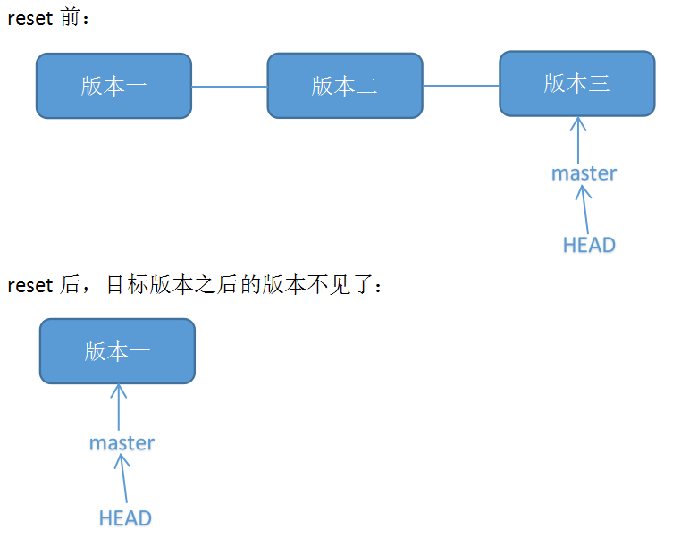

而 revert 是回滚一个commit，再把这个回滚commit，如下图：

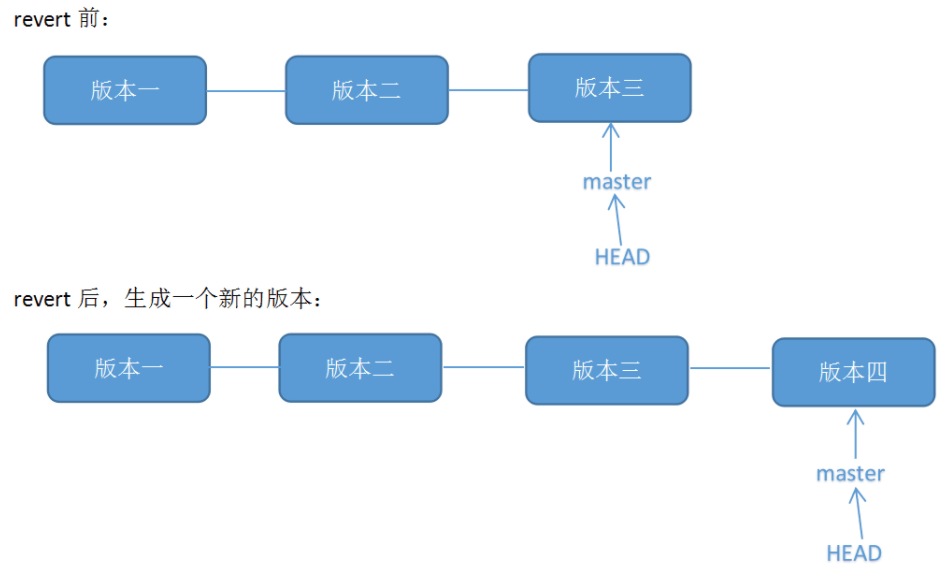

#### 总结

reset 是删除到某个commit，期间所有commit都会被回滚；revert 是回滚某个commit，只回滚一个commit，并且生成一个新的commit；

reset 时HEAD是向后移动了；revert 只不过是反向提交，它的HEAD是一直向前的；

reset 会造成大量的冲突，所以适合在本地开发同时没有push到远端的时候使用；而revert造成的冲突非常有限，适合在push到远端的代

码进行回滚。

#### undo

项目名右键—>Git—>Show History—>选中某次提交记录—>Undo Commit，如下图所示

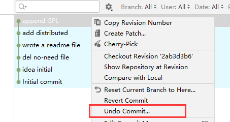

如果你查看源代码，会发现undo就是`reset soft`。


但是idea对它进行了一定的限制和提示，它只能作用于最后一个commit，把这个commit从工作树删除，并且保留修改，同时建立一个

New Changlist。效果如下：

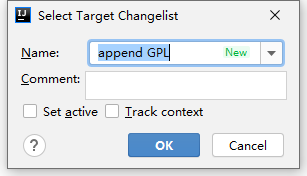

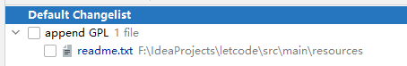

这个名为append GPL的New Changlist可以将改动的文件分门别类的放置在不同的文件夹中，等全部修改完毕后一起提交，一般在分模

块开发时会使用。也就是在开发完一个完整的模块时，将这个模块上改动的代码设置到一个文件夹中，然后再一起提交。

### 撤销修改

想要撤销修改需要考虑以下四种情况：

1、未add

2、已add但未commit

3、已commit但未push

4、已经push

#### 未add

IntelliJ IDEA的自动add只能add新创建的内容，修改过后的内容会在commit的时候自动add

#### 已add但未commit

按照如下图所示的操作，即可达到`git reset HEAD <file>` 和`git checkout -- file`的操作。让未commit的修改全部消失。

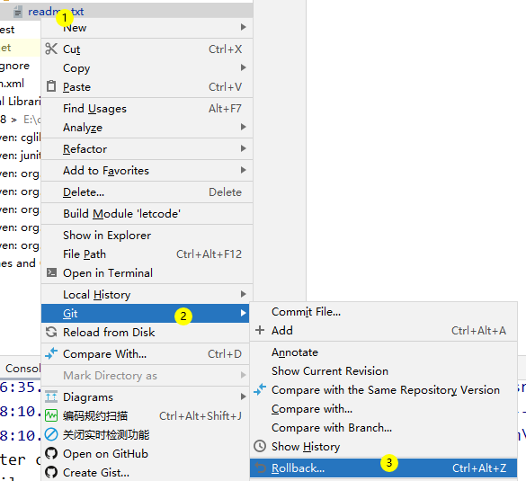

由于idea的特殊机制，我们还可以有一种操作。

按照下图指示，依次点击左边框的绿色条状长条，回滚箭头，即可撤销修改。这和git checkout -- file非常类似，但是实现原理不同，git 

checkout -- file是使用暂存区的文件替换原有文件，而idea使用的是编译器自身的功能，类似ctrl+z。

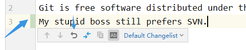

消失的内容可以按照下图指示进行查询。


#### 已commit但未push

可以使用上文介绍的reset和revert回滚。如果已经add但是未commit的内容非常多，也可以先commit，然后再使用reset和revert回滚

#### 已经push

同样可以使用reset和revert回滚，只不过需要commit+push的操作才能通过修改的方式来实现撤销。

### 删除文件

如果你使用Git指令，那么你需要像添加操作一样，先手动删除文件，然后使用指令`git rm test.txt`，将删除操作加载到暂存库，然后

再commit到本地仓库。

如果使用idea的图形化版本控制插件，直接删就行，下次commit会把删除的动作也提交上去。

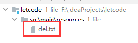

## 分支管理

### 创建

master就是默认的主分支，创建分支非常简单，只需要按照下图提示点击，弹出对话框输入名字即可。

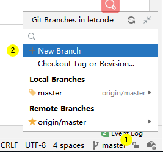

IDEA在创建完分支后会自动切换，也就是`git checkout -b dev`指令的效果。

如何查找自己所在的分支？非常简单，在编辑器的右下角可以查看。等于`git branch`的效果

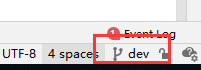

### 合并分支

合并分支（merge）也非常简单，首先我们切换到主分支，操作如下：

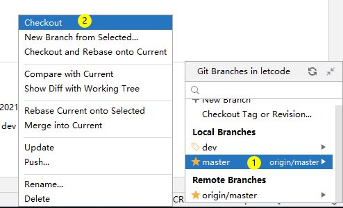

然后我们选择要合并的分支点击merge into current。

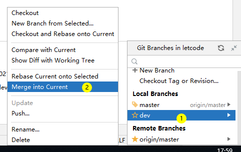

合并完成后，还是在同一个菜单，点击delete即可删除分支。

### 解决冲突

创建一个新的分支，和master分支分别commit不同的内容。具体如下：

```
Git is a distributed version control system.
Git is free software distributed under the GPL.
Creating a new branch is quick AND simple.
```

master分支

```
Git is a distributed version control system.
Git is free software distributed under the GPL.
Creating a new branch is quick & simple.
```

可以看出两个版本有一个不同就是&和AND，如果merge，会发生什么？会弹出一个冲突的界面

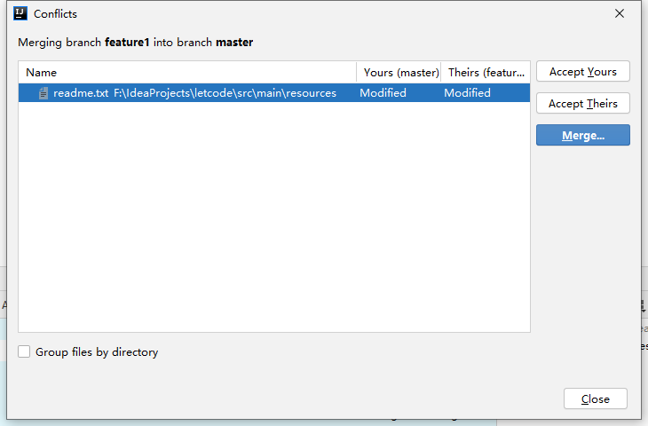

在这个界面中有很多快捷按钮，但都不是我们介绍的重点，我们需要双击readme.txt来查看冲突并解决它，双击结果如下：

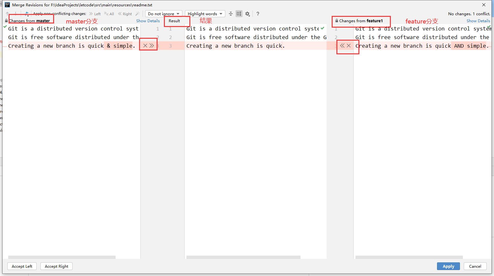

我们可以清晰地看出界面分为左中右三个板块，分别是当前分支master、合并后的结果和需要合并的分支feature。同时上方有很多便捷

操作的按钮，具体功能大家可以尝试一下，非常简单。我们合并的主要操作就是三个板块相连的间隔中的X和>>来实现，X就是放弃修

改，>>就是选择修改。同时三个板块都是可以编辑的文件，也就是说在合并过程中你都是可以增加代码和注释的。在这里我们需要放弃

&，然后保留AND，合成完成的结果如下：

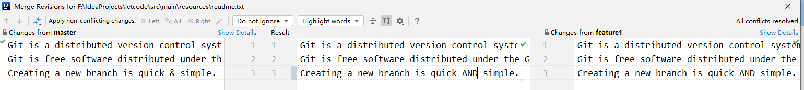

合并完成再看Git log，会发现一个分支创建又合并的过程。

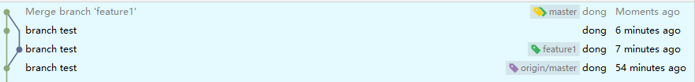

### Bug 分支（stash+cherry-pick）

有这样一个场景，当你接到一个修复一个代号101的bug的任务时，很自然地，你想创建一个分支issue-101来修复它，但是，等等，当前

正在dev上进行的工作还没有提交。并不是你不想提交，而是工作只进行到一半，还没法提交，预计完成还需1天时间。但是，必须在两个

小时内修复该bug，怎么办？

解决方法，就是使用stash，很简单的道理，就是隐藏未提交的代码，并保持。

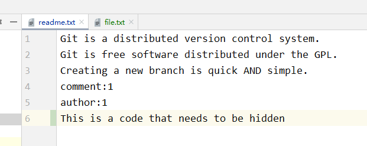

如图所示，可以看出有两个修改，一个是添加了新的文件file.txt，第二个是加了一行代码。而我们的bug就是comment和author的内容

写错了。按照图示进行点击，即可实现`git stash`指令的效果。

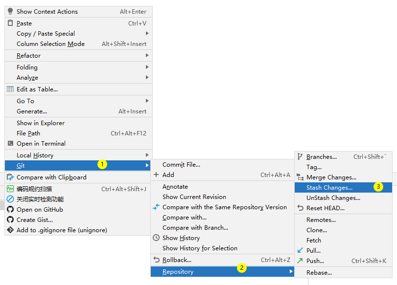

少顷，修改的代码就会消失，如下图。这时我们就可以切换分支修改bug了，注意当前分支如果有未提交的代码是不能切换分支的会导致

代码丢失。

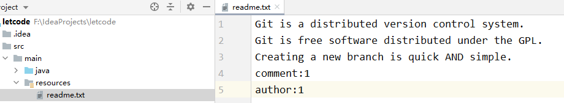

此时新建立了一个issue-101分支然后修改过后再合并到master，我们就直接在master上面修改即可。

发生了新问题，在master分支上修复了bug后，dev分支是早期从master分支分出来的，所以，这个bug其实在当前dev分支上也存在。

那怎么在dev分支上修复同样的bug？重复操作一次，提交不就行了？

但有更简单的方法，就是`cherry-pick`命令。如图所示即可实现对单个commit的同步操作。

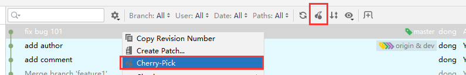

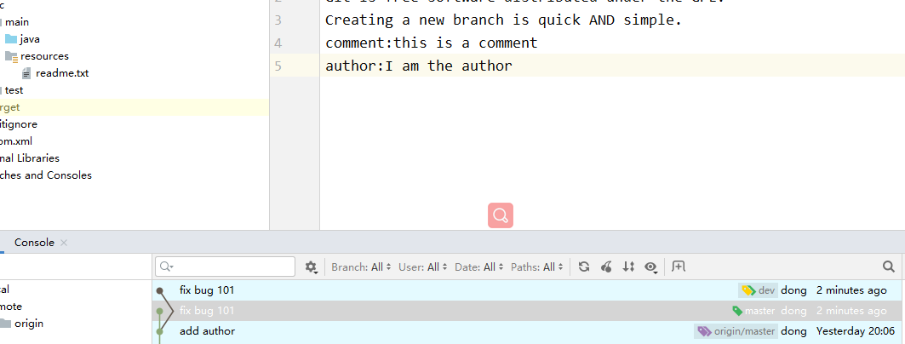

我们再点击Stash Changes…同一菜单的unStash Changes…来查看stash 列表，效果等同于`git stash list`。

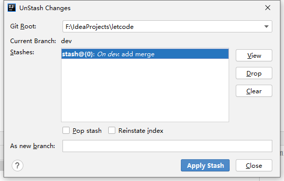

View：查看隐藏的代码

Drop：删除选中隐藏

Clear：清空所有隐藏

Apply Stash：将隐藏代码恢复

Pop stash：Apply的同时会Drop隐藏

点击Apply Stash就能让隐藏的代码恢复。注意Stash过后的分支如果你又有新的改动一定要commit，如果不commit，当你使用Apply 

Stash重新获取代码的时候就会失败，也有可能因为操作不当导致代码消失。如果有了新的commit，在apply stash时就会当成融合冲突

处理。就比如我们现在，因为我们融合了master上面修改的代码，所以现在的代码和stash时的代码不一样了，就需要处理一下。方法就

和之前的merge一样。

然后就发现代码又回来了，如果这里file.txt没有出现，请刷新一下文件。

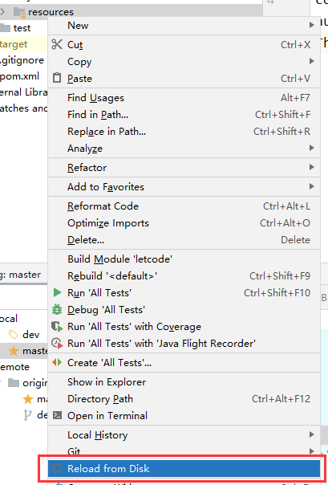

### 多人协作（pull+push）

右上角工作区—>左下指向蓝色箭头，效果相当于git pull


推送和拉取在idea中形象的被两个简单所表示，蓝色的向下的时拉取，绿色的向上的时推送。idea中拉取是update project。git fetch是

抓取远程仓库修改的内容，抓取到后不会改变本地仓库，只有git merge的时候才会改变。而git pull就是fetch+merge的组合，和update 

project效果一样。

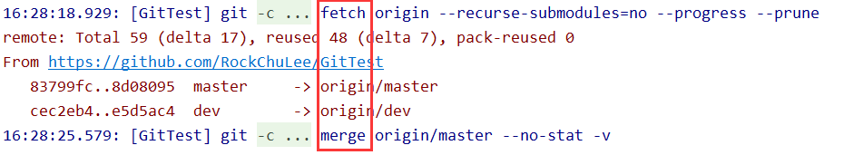

推送就是`git push`，一模一样。这里push还有一个小技巧，就是在commit的时候可以直接使用push，省去了多一步的操作。

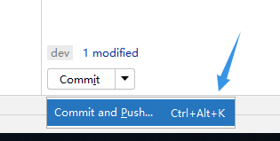

如何拉取远程仓库分支，如下：

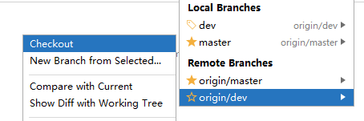

效果就是创建一个本地分支，再和远程仓库进行连接，等同于checkout -b dev origin/dev。

多人操作的情况下，你的每次改动都需要考虑到别人的代码是否也发生了改动，所有在每次push的时候idea都会主动申请一次pull操作，

如果有冲突，先处理冲突在push，没有就直接push。

### rebase

在实际开发中很少使用到变基，因为有一定的危险性，所有使用者尤其是新手一定要慎用。

情况一：当合并别人的提交时

当多人提交时，我们必须要先融合别人的代码，所以必定会形成下图这种分叉然后再回归的情况。

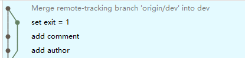

而我们使用变基（rebase）就可以避免这一情况。在update project的时候选择下面的选项。

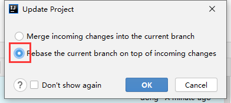

效果如下图

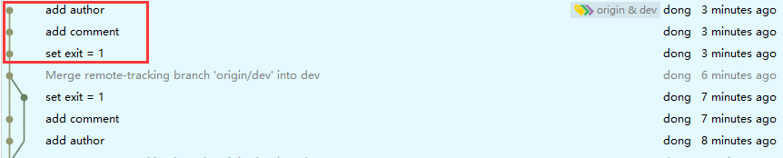

情况二：当合并不同分支时

操作如下：


但是一定要注意，这个和merge的不同，merge是将选择的分支合并到当前分支，而rebase是将当前分支变基到选择的分支。也就是说为

了达到合并feature1代码的效果，如果我们使用merge，我们应该切换到dev，然后选择feature1进行merge操作。如果我们使用

rebase，我们应该切换到feature1，然后选择dev进行rebase操作。

## 标签管理

项目名称右键Git—>Show History


Push Tag的操作在push commit的操作窗口的右下角。


删除已经提交的Tag需要再删除远程仓库的Tag，单机提示框的delete on Remote即可


# 九、Tomcat

## 9.1、tomcat启动控制台

deployment会把下面的log区域遮住

点击debug模式下控制台右上角Layout，取消勾选deployment

# 十、其它

## 10.1、文件类型显示异常

文件类型显示异常，Java文件类型名称左侧都是J，比如接口不显示I而显示J

产生原因：启用了Power Save Mode

解决方法：File ->取消勾选Power Save Mode

## 10.2、开启正则辅助

```
str.matches("")在双引号之间Alt/Option + Enter，选择Check RegexExp，在RegExp填写\d，在双引号之间会自动转译填写为\\d
```
