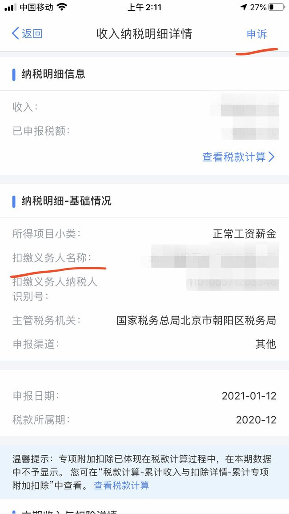
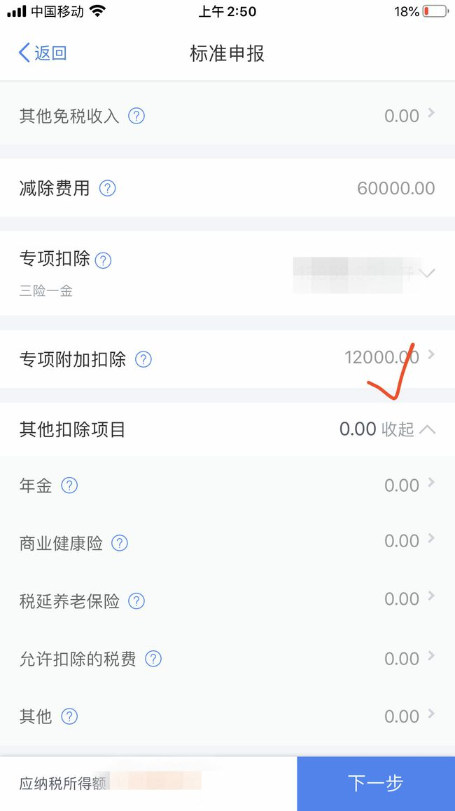
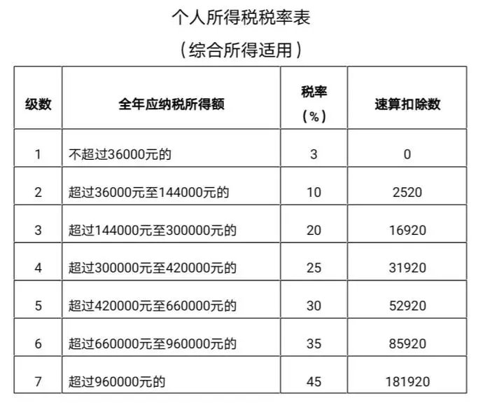
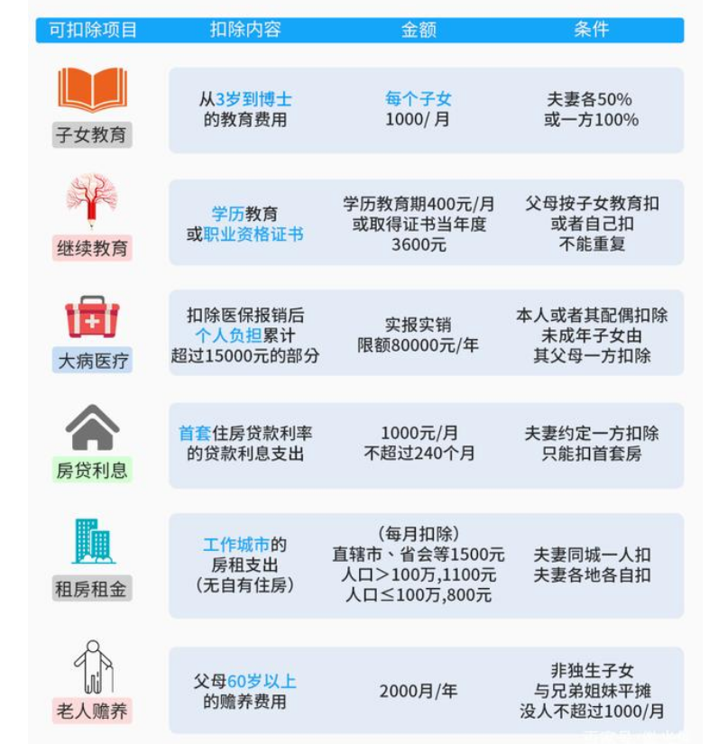

每年**3月1号**开始就可以进行上年度的个税退税的操作了，截止时间为**6月30号**。小伙伴们先别急着直接申报退税，这篇攻略有可能让你多

退几千甚至上万元。

# 一、准备工作

## 1、下载

APP市场搜索“个人所得税”，下载安装

## 2、注册

点击右下角个人中心。如果没有账号的同学先注册一个账号，记得用真实姓名、手机和身份证号。

## 3、填写受雇信息

注册完成之后进入个人中心，点击“任职受雇信息”

里面会有你详细的任职单位信息，各位注意一定要看仔细了，是不是你当前任职的公司，有任何其他公司或者你之前任职过的公司都是不可以的，因为你的个人信息有可能会泄露，其他公司，甚至你的前公司都有可能利用你的个人信息给你一份名义上的“工资”进行避税，你当然不会收到钱，却会因此额外多交税！

## 4、填写家庭成员信息

接下来点击个人中心里面的家庭成员信息，把你配偶、孩子、父母的信息全部录入进去，这些信息可以帮你多退一大笔钱。

## 5、绑定银行卡

然后绑定你名下的一张银行卡，用于接收返还回来的税款，准备工作就基本完毕了。

## 6、收入纳税明细查询

返回APP首页，向下滑，点击“常用业务”中的“收入纳税明细查询”

纳税记录年度选择去年，此时以“2020”年做举例，所得类型默认四项全选，不要更改，点击查询。

“收入合计”显示的是你2020年度所有渠道的收入总额。

“已申报税额合计”显示的是你2020年已交的税款。

下面的列表里有你2020年的所有收入来源，切记一项一项准确核对每笔收入。刚才馆长说过的，你的个人身份信息可能已经泄露了，会

有不法分子用你的名义注册公司、开工资、签合同、开发票等等，这些行为都会被记录在这个列表里，一旦你发现哪笔确定没有过的收

入，一定要联系扣缴义务人进行核实。如果无法核实请点击右上角申诉，因为对方的这种行为可能已经涉及到逃税了，问题很严重的。

# 二、专项附加扣除填报

下面就是重点了，返回APP首页，点击“常用业务”中的“专项附加扣除填报”。

解释一下什么是专项附加扣除：这是从2019年1月1日开始实施的，可以抵扣个人所得税应纳税额的新措施，一共有六项：

## 1、子女教育

你的子女年龄从3岁到博士研究生毕业之前接受全日制学历教育的阶段，你每月都可以申请1000元的标准定额扣除

进入之后点击下一步

### 基本信息

### 子女教育信息

点击“子女信息”，“选择子女”选择你之前在家庭成员信息里面添加的子女信息。

下个页面“子女教育信息”

“当前受教育阶段”据实选择就行

“当前受教育阶段开始时间”选择入学那年的9月份

“当前受教育阶段结束时间”和“子女教育终止时间”可以不填

就读学校据实填写。

### 设置扣除比例

点击下一步，本人扣除比例选项

如果夫妻双方收入相差比较大，可以选择收入较高的一方100%扣除

如果夫妻双方收入差不多，也可以每人扣除50%

### 申报方式

申报方式选择“综合年度自行申报”（下同）

如果申报成功，在“申报记录详情”可以看到“专项附加扣除合计”这里从0变成了12000元。

## 2、继续教育

如果你正在接受学历（学位）的继续教育，那么每月可申请400元的定额扣除；如果你接受技能人员职业资格继续教育、专业技术人员职业资格继续教育，并且在去年取得了证书，那么可以按照3600元定额扣除，根据个人情况如实填写即可，如申报成功，“专项附加扣除”就会增加4800元。

## 3、大病医疗

如果去年扣除医保后，医药费支出超过15000元，那么在80000元以内可以据实扣除。注意，未成年子女和配偶的医药费是可以和你一起

计算的，需要提供患者的证件信息，根据个人实际情况填写即可。

## 4、住房贷款利息

如果你去年正担负着首套房贷，那么每月可申请1000元的定额扣除，根据你的房屋所有权证、不动产权证、房屋买卖合同或者房屋预售

合同填写即可。

### 基本信息

### 房贷信息

下一页，贷款方式，据实填写，其中贷款合同编号和首次还款日期需要你给当初贷款的银行客服打电话进行咨询，这几天应该很多人打电话咨询的，你一说要抵税，他们就知道应该向你提供什么了。扣除比例还是根据夫妻双方收入状况来安排的，如果申报成功，“专项附加扣除”就会增加12000元

## 5、住房租金

对于租房的小伙伴，也有相对应的政策，如果你在直辖市、省会（首府）城市、计划单列市以及国务院确定的其他城市租房，每月扣除标

准为1500元；

如果你所在市辖区人口超过100万，扣除标准为每月1100元；

其余城市扣除标准为每月800元。需要注意，住房贷款和住房租金两项只能二选一了

## 6、赡养老人

如果父母年满60岁，独生子女每月可扣除2000元；

非独生子女的，和兄弟姐妹分摊每月2000元的扣除额度。

进入之后直接添加父母的信息，选择是否是独生子女

如果申报成功，“专项附加扣除”就会增加24000元

# 三、综合所得年度汇算

一切准备就绪之后就可以进行最终的申报了

返回APP首页，点击“常用业务”中的“综合所得年度汇算”

申报年度选择2020年度

## 1、开始申报

点击“开始申报”

## 2、标准申报

这时注意屏幕最上方，如果显示的是“简易申报”请点击右上角切换成“标准申报”，如果是“标准申报”则无需理会。

## 3、基本信息

在汇缴地一栏选择一家你目前任职的公司，点击下一步。

## 4、确认收入

首先核对一下“收入”和“费用、免税收入和税前扣除”各部分的数字是否无误

如果你的“收入”中存在奖金，比如一次性大额的年终奖，会有提示你在详情中确认

是全部并入综合所得计税还是单独计税。

一般来说，公司年终都会发你一笔双薪或者三薪，再加上七七八八的奖金至少有好几万块钱。

根据超额累进税率，这笔钱如果单独计税，会适用较高的税率导致多交税，选择“全部并入综合所得计税”把这笔钱分摊到12个月，就能继续享受低税率。

但这里有个坑，馆长帮你避一下。有的公司会根据超额累进税率给你卡着较低一档的工资，比如全年应纳税所得额144000元以下，税率是10%，超过144000元适用20%税率，如果你的全年应纳税收入是144001元，只多了一块钱，你就需要多交14400元的税。

所以各位留意一下自己的全年应纳税所得额是否卡在下面几个数字的线上：

36000元

144000元

300000元

420000元

660000元

960000元

如果刚刚好卡在线上，又恰好位于较高的一档，你把你的奖金设置成单独计税，这样税率就会下调一档（减少5%~10%），就这一个操作

就能给你省下几千甚至几万的税款。

接下来看“减除费用”一项，每个人都是60000，因为个税起征点是5000元，一年正好是60000，如果你全年收入小于6万，那么之前缴纳

的个人所得税是可以全额返还的。

## 5、确认专项扣除

下一项，“专项扣除”。这里就是你任职的公司给你缴纳的三险一金了，请仔细核对数额是否正确。

在下面一项“专项附加扣除”后面的数字就是申请出来的抵扣额度。

## 6、确认应纳税所得额

左下角的“应纳税所得额”显示的是你2020年度所有应税收入之和。

## 7、确认应退税额

如果这个数字是0或者小于你在一开始查询到的“收入合计”，那么恭喜你，这表示馆长的这篇攻略确实帮到你了。

点击下一步，左下角“应退税额”就是你能拿到的钱。

点击下一步，“申请退税”大功告成

接下来就等待审核，收米米了

OK，打完收工

# 四、总结

新增**计算公式**和**税率阶梯表**还有**专项扣除**

## 个税退税计算公式

　　应退或应补税额=[(综合所得收入额-60000元-“三险一金”等专项扣除-子女教育等专项附加扣除-依法确定的其他扣除-捐赠)×适用税率-

速算扣除数]-2020年已预缴税额

## 专项扣除部分

